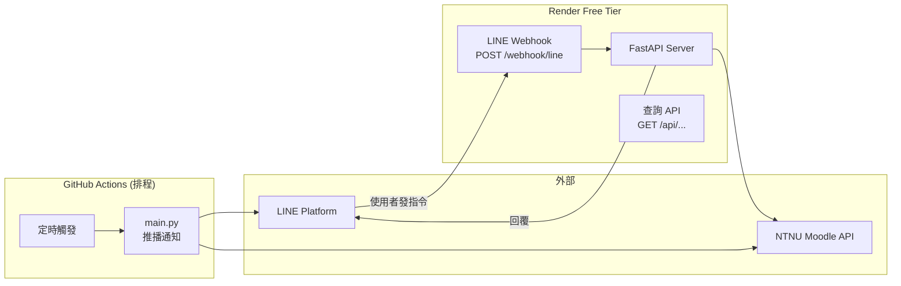

# Moodle 替代平台 — 實作計畫

## 決策摘要

| 問題 | 決定 |
|------|------|
| 部署 | GitHub Actions + 免費雲端（Render/Vercel），未來可遷移自有伺服器 |
| LINE Bot | 推播 + 互動指令（需 Webhook Server） |
| Web 技術 | Vite SPA（前端）+ Python FastAPI（後端） |
| 開發順序 | 分三階段遞增 |
| 開源模板 | 是，保持其他使用者易部署 |
| 多平台 | 支援 LINE + 未來 Discord，抽象化通知介面 |

---

## 三階段開發藍圖

```mermaid
gantt
    title 開發階段
    dateFormat X
    axisFormat %s
    section Phase 1
    核心 API 重構 + 模組化          :p1, 0, 3
    新通知（公告/成績/私訊）        :p1b, 1, 3
    通知介面抽象化                  :p1c, 2, 3
    section Phase 2
    FastAPI 後端 + LINE Webhook    :p2, 3, 5
    LINE Bot 指令系統              :p2b, 4, 6
    section Phase 3
    Web Dashboard (Vite SPA)       :p3, 6, 9
    檔案中心/成績頁/行事曆          :p3b, 7, 9
```



---

## Phase 1：核心重構（API 驅動 + 模組化）

> 目標：不改變部署環境（仍在 GitHub Actions），但完全重構內部架構。

### 新專案結構

```
moodle-notifier/
├── .github/
│   └── workflows/
│       └── monitor.yml              # [MODIFY] 更新排程設定
│
├── src/                             # [NEW] 主要程式碼目錄
│   ├── __init__.py
│   ├── config.py                    # [NEW] 設定管理（環境變數、常數）
│   ├── moodle_client.py             # [NEW] Moodle API 封裝層
│   ├── diff_engine.py               # [NEW] 資料差異比對引擎
│   ├── models.py                    # [NEW] 資料模型定義
│   ├── storage.py                   # [NEW] 持久化儲存（JSON 讀寫）
│   │
│   ├── notifiers/                   # [NEW] 通知介面（抽象化）
│   │   ├── __init__.py
│   │   ├── base.py                  # [NEW] 抽象基類 NotifierBase
│   │   ├── line_notifier.py         # [NEW] LINE Push 實作
│   │   └── discord_notifier.py      # [NEW] Discord Webhook 實作（預留）
│   │
│   └── monitors/                    # [NEW] 各功能模組的監控器
│       ├── __init__.py
│       ├── course_monitor.py        # [NEW] 課程內容變更偵測
│       ├── assignment_monitor.py    # [NEW] 作業追蹤 + 催繳
│       ├── announcement_monitor.py  # [NEW] 公告偵測
│       ├── grade_monitor.py         # [NEW] 成績變更偵測
│       └── message_monitor.py       # [NEW] 私訊轉發偵測
│
├── main.py                          # [NEW] 主入口（取代 main_monitor.py）
├── main_monitor.py                  # [DELETE] 舊的單檔架構
├── requirements.txt                 # [NEW] 依賴管理
├── README.md                        # [MODIFY] 更新文件
└── .gitignore                       # [MODIFY] 更新排除規則
```

---

### [NEW] `src/config.py` — 設定管理

集中管理所有設定值，支援環境變數和本機安全檔案。

```python
# 核心設定
TARGET_SEMESTER: str          # e.g. "1142"
DATA_DIR: str                 # 資料儲存目錄
MOODLE_BASE_URL: str          # "https://moodle3.ntnu.edu.tw"

# 憑證（環境變數 → 本機安全檔案 → 報錯）
MOODLE_USERNAME: str
MOODLE_PASSWORD: str

# 通知平台設定（依啟用的平台載入）
LINE_USER_ID: str | None
LINE_CHANNEL_ACCESS_TOKEN: str | None
DISCORD_WEBHOOK_URL: str | None

# 可調參數（使用者可透過環境變數覆蓋）
MAX_WORKERS: int = 10                 # 並行數
HTTP_TIMEOUT: int = 15                # HTTP 超時秒數
URGENT_HOURS: int = 24                # 緊急催繳門檻（小時）
WARNING_DAYS: int = 3                 # 警告提醒門檻（天）
DAILY_REPORT_HOUR: int = 18           # 日報發送時間
NOTIFICATION_COOLDOWN_HOURS: int = 6  # 同一催繳最小間隔
```

**設計決策**：所有設定值都可透過環境變數覆蓋，讓 fork 使用者無需改程式碼。

---

### [NEW] `src/moodle_client.py` — Moodle API 封裝層

封裝所有 Moodle Web Service API 呼叫，提供型別安全的介面。

```python
class MoodleClient:
    """Moodle Web Services API 客戶端"""
    
    def __init__(self, base_url: str, username: str, password: str):
        self.base_url = base_url
        self.token: str | None = None
        self.user_id: int | None = None
        self.session = requests.Session()
        # 掛載重試策略
        retry = Retry(total=3, backoff_factor=1, status_forcelist=[500, 502, 503, 504])
        self.session.mount("https://", HTTPAdapter(max_retries=retry))
    
    def authenticate(self) -> None:
        """透過 login/token.php 取得 Mobile App Token"""
    
    def _call_api(self, function: str, **params) -> dict:
        """底層 API 呼叫（含錯誤處理）"""
    
    # --- 課程相關 ---
    def get_user_courses(self) -> list[dict]:
        """取得使用者的所有課程"""
    
    def get_course_contents(self, course_id: int) -> list[dict]:
        """取得單門課程的完整內容結構"""
    
    def get_updates_since(self, course_id: int, since: int) -> list[dict]:
        """取得課程自某時間以來的變更"""
    
    # --- 作業相關 ---
    def get_assignments(self, course_ids: list[int]) -> dict:
        """批量取得多門課程的作業"""
    
    def get_submission_status(self, assign_id: int) -> dict:
        """取得單一作業的繳交狀態"""
    
    # --- 討論區/公告 ---
    def get_forums(self, course_ids: list[int]) -> list[dict]:
        """取得課程的討論區列表"""
    
    def get_forum_discussions(self, forum_id: int, limit: int = 5) -> list[dict]:
        """取得討論區的討論串"""
    
    # --- 成績 ---
    def get_grade_items(self, course_id: int) -> list[dict]:
        """取得課程的成績項目"""
    
    # --- 私訊 ---
    def get_unread_message_count(self) -> dict:
        """取得未讀私訊數"""
    
    def get_conversations(self, limit: int = 10) -> list[dict]:
        """取得最近的對話"""
    
    # --- 行事曆 ---
    def get_upcoming_events(self, limit: int = 20) -> list[dict]:
        """取得即將到來的事項"""
    
    # --- 檔案 ---
    def get_file_url(self, file_url: str) -> str:
        """為檔案 URL 附加 Token"""
```

**設計決策**：
- 內建 HTTP 重試機制（3 次重試 + 指數退避）
- Token 取得一次後重複使用（Moodle Mobile Token 不過期）
- 所有 API 回傳原生 dict，由呼叫方負責轉換

---

### [NEW] `src/models.py` — 資料模型

```python
@dataclass
class Course:
    id: int
    fullname: str
    shortname: str

@dataclass
class Assignment:
    id: int
    course_id: int
    course_name: str
    name: str
    due_date: datetime | None    # 從 Unix timestamp 轉換
    intro: str                    # 作業說明 (HTML)
    status: str                   # "submitted" | "new" | "draft"
    grade: str | None             # 成績
    intro_hash: str               # 說明內容 hash（偵測修改用）

@dataclass 
class Announcement:
    id: int
    course_id: int
    course_name: str
    forum_id: int
    title: str
    author: str
    message: str                  # HTML 內容
    time_modified: datetime

@dataclass
class GradeItem:
    course_id: int
    course_name: str
    item_name: str
    grade: str | None
    
@dataclass
class MoodleMessage:
    conversation_id: int
    sender_name: str
    text: str
    time: datetime
    is_read: bool
```

---

### [NEW] `src/notifiers/base.py` — 抽象通知介面

```python
from abc import ABC, abstractmethod

class NotifierBase(ABC):
    """通知發送的抽象基類，所有通知平台都實作此介面"""
    
    @abstractmethod
    def send_text(self, message: str) -> bool:
        """發送純文字訊息"""
    
    @abstractmethod
    def send_alert(self, title: str, body: str, url: str | None = None) -> bool:
        """發送警示通知（含標題和可選連結）"""
    
    @abstractmethod
    def send_daily_report(self, report: dict) -> bool:
        """發送每日日報"""
    
    @property
    @abstractmethod
    def platform_name(self) -> str:
        """平台名稱（用於日誌）"""
```

> [!IMPORTANT]
> 抽象化通知介面是支援多平台的關鍵。LINE 和 Discord 都實作同一個 `NotifierBase`，主程式只需面對介面，不需知道底層是哪個平台。

---

### [NEW] `src/notifiers/line_notifier.py` — LINE 推播實作

```python
class LineNotifier(NotifierBase):
    """LINE Messaging API Push 通知實作"""
    
    def __init__(self, channel_token: str, user_id: str):
        self.channel_token = channel_token
        self.user_id = user_id
    
    def send_text(self, message: str) -> bool:
        # LINE 單則訊息上限 5000 字，超過自動分段
    
    def send_alert(self, title: str, body: str, url: str | None = None) -> bool:
        # 使用 Flex Message 卡片格式
    
    def send_daily_report(self, report: dict) -> bool:
        # 結構化的日報訊息
```

---

### [NEW] `src/notifiers/discord_notifier.py` — Discord 預留

```python
class DiscordNotifier(NotifierBase):
    """Discord Webhook 通知實作（預留）"""
    
    def __init__(self, webhook_url: str):
        self.webhook_url = webhook_url
    
    def send_text(self, message: str) -> bool:
        # Discord Webhook POST
    
    def send_alert(self, title: str, body: str, url: str | None = None) -> bool:
        # Discord Embed 格式
    
    def send_daily_report(self, report: dict) -> bool:
        # Discord Embed 日報
```

---

### [NEW] `src/monitors/` — 監控模組

每個 monitor 負責一個功能領域的「偵測 → 比對 → 產生通知」邏輯。

#### `assignment_monitor.py`

```python
class AssignmentMonitor:
    def __init__(self, client: MoodleClient, storage: Storage):
        self.client = client
        self.storage = storage
    
    def check(self, courses: list[Course]) -> list[Notification]:
        """
        回傳所有待發送的通知：
        - 新作業
        - 作業說明修改
        - 催繳（分級：7天/3天/24小時/已逾期）
        - 催繳去重（同一作業 N 小時內不重複通知）
        """
```

#### `announcement_monitor.py`

```python
class AnnouncementMonitor:
    def __init__(self, client: MoodleClient, storage: Storage):
        ...
    
    def check(self, courses: list[Course]) -> list[Notification]:
        """
        偵測各課程公告區的新帖子
        - 比對已知的 discussion ID 列表
        - 新的 discussion = 新公告
        """
```

#### `grade_monitor.py`

```python
class GradeMonitor:
    def __init__(self, client: MoodleClient, storage: Storage):
        ...
    
    def check(self, courses: list[Course]) -> list[Notification]:
        """
        偵測成績變更
        - 比對各課程的 grade items
        - 從 None → 有分數 = 新成績
        - 分數改變 = 成績更新
        """
```

#### `message_monitor.py`

```python
class MessageMonitor:
    def __init__(self, client: MoodleClient, storage: Storage):
        ...
    
    def check(self) -> list[Notification]:
        """
        偵測新的 Moodle 私訊
        - 檢查未讀對話數
        - 與上次已知的對話狀態比對
        """
```

---

### [NEW] `src/diff_engine.py` — 差異比對引擎

```python
class DiffEngine:
    """統一的資料差異比對邏輯"""
    
    @staticmethod
    def detect_new_items(old_items: list, new_items: list, key: str) -> list:
        """偵測新增項目（依 key 欄位比對）"""
    
    @staticmethod
    def detect_modified_items(old_items: list, new_items: list, 
                               key: str, hash_field: str) -> list:
        """偵測已修改項目（依 hash 比對）"""
    
    @staticmethod
    def detect_removed_items(old_items: list, new_items: list, key: str) -> list:
        """偵測已移除項目"""
```

---

### [NEW] `src/storage.py` — 持久化儲存

```python
class Storage:
    """JSON 檔案儲存，支援原子性寫入"""
    
    def __init__(self, data_dir: str, semester: str):
        self.data_file = f"moodle_data_{semester}.json"
    
    def load(self) -> dict:
        """載入資料庫"""
    
    def save(self, data: dict) -> None:
        """原子性寫入（tempfile + os.replace）"""
    
    def get_last_check_time(self) -> int:
        """取得上次檢查的 Unix timestamp"""
    
    def get_notification_history(self, key: str) -> datetime | None:
        """取得特定通知的最後發送時間（催繳去重用）"""
    
    def record_notification(self, key: str) -> None:
        """記錄通知已發送"""
```

---

### [NEW] `main.py` — 主入口

```python
def main():
    # 1. 載入設定
    config = Config.load()
    
    # 2. 初始化元件
    client = MoodleClient(config.moodle_base_url, config.username, config.password)
    client.authenticate()
    
    storage = Storage(config.data_dir, config.target_semester)
    
    # 3. 初始化通知器（依設定啟用對應平台）
    notifiers: list[NotifierBase] = []
    if config.line_token:
        notifiers.append(LineNotifier(config.line_token, config.line_user_id))
    if config.discord_webhook_url:
        notifiers.append(DiscordNotifier(config.discord_webhook_url))
    
    # 4. 取得課程
    courses = client.get_user_courses()
    semester_courses = [c for c in courses if config.target_semester in c.fullname]
    
    # 5. 執行各監控器
    monitors = [
        AssignmentMonitor(client, storage),
        AnnouncementMonitor(client, storage),
        GradeMonitor(client, storage),
        CourseMonitor(client, storage),
        MessageMonitor(client, storage),
    ]
    
    all_notifications = []
    for monitor in monitors:
        notifications = monitor.check(semester_courses)
        all_notifications.extend(notifications)
    
    # 6. 發送通知（所有平台）
    for notification in all_notifications:
        for notifier in notifiers:
            notifier.send_alert(notification.title, notification.body, notification.url)
    
    # 7. 每日日報
    if should_send_daily_report(config, storage):
        report = build_daily_report(monitors, storage)
        for notifier in notifiers:
            notifier.send_daily_report(report)
    
    # 8. 儲存狀態
    storage.save(current_state)
```

---

### [MODIFY] `.github/workflows/monitor.yml`

```yaml
name: Moodle Monitor Bot

on:
  schedule:
    - cron: '0 0,2,4,6,8,10,12,14 * * 1-5'   # 平日每 2 小時
    - cron: '0 2,10,14 * * 0,6'                 # 週末降頻
  workflow_dispatch:

# ... (env 新增 DISCORD_WEBHOOK_URL 等可選變數)

    - name: Run Moodle Monitor
      env:
        MOODLE_USERNAME: ${{ secrets.MOODLE_USERNAME }}
        MOODLE_PASSWORD: ${{ secrets.MOODLE_PASSWORD }}
        LINE_USER_ID: ${{ secrets.LINE_USER_ID }}
        LINE_TOKEN: ${{ secrets.LINE_TOKEN }}
        DISCORD_WEBHOOK_URL: ${{ secrets.DISCORD_WEBHOOK_URL }}  # 可選
        TARGET_SEMESTER: "1142"
        TZ: Asia/Taipei
      run: python main.py
```

---

## Phase 2：LINE Bot 互動 + FastAPI 後端

> 目標：部署 FastAPI 到 Render 免費 tier，處理 LINE Webhook 讓使用者可以發指令查詢。

### 架構



### 新增檔案

```
server/
├── app.py                    # [NEW] FastAPI 主應用
├── routers/
│   ├── line_webhook.py       # [NEW] LINE Webhook 路由
│   └── api.py                # [NEW] 查詢 API 路由（供 Phase 3 Web 使用）
├── handlers/
│   ├── command_parser.py     # [NEW] 指令解析器
│   └── command_handlers.py   # [NEW] 各指令的處理邏輯
├── Dockerfile                # [NEW] Render 部署用
└── render.yaml               # [NEW] Render 設定
```

### LINE Webhook 處理流程

```python
@router.post("/webhook/line")
async def line_webhook(request: Request):
    body = await request.json()
    for event in body.get("events", []):
        if event["type"] == "message" and event["message"]["type"] == "text":
            text = event["message"]["text"]
            reply_token = event["replyToken"]
            
            # 解析指令
            response = await handle_command(text)
            
            # 回覆（使用 Reply API，免費不計費）
            reply_message(reply_token, response)
    
    return {"status": "ok"}
```

> [!NOTE]
> **LINE Reply API vs Push API**：使用者主動發訊息後，用 Reply API 回覆是**完全免費**的（不計入 Push 訊息額度）。這意味著互動指令不會消耗額外費用。

### Render 冷啟動對策

Render 免費 tier 在 15 分鐘無請求後會休眠，冷啟動約 30 秒。對策：
- GitHub Actions 排程中加入 `curl` 預熱請求
- 或使用 [UptimeRobot](https://uptimerobot.com/)（免費）每 5 分鐘 ping 一次保持喚醒

---

## Phase 3：Web Dashboard

> 目標：建立自製網頁，部署到 GitHub Pages（免費），呼叫 Phase 2 的 FastAPI 後端。

### 技術選型

| 層級 | 技術 | 理由 |
|------|------|------|
| 前端框架 | Vite + Vanilla JS | 輕量、快速、無框架學習成本 |
| 樣式 | Vanilla CSS | 完全控制、無依賴 |
| 部署 | GitHub Pages | 免費、與 repo 整合 |
| 資料來源 | FastAPI 後端 API | Phase 2 已建好 |

### 頁面設計

```
web/
├── index.html                # 首頁儀表板
├── courses.html              # 課程列表
├── course.html               # 單一課程詳情
├── assignments.html          # 作業追蹤器
├── grades.html               # 成績中心
├── announcements.html        # 公告中心
├── calendar.html             # 行事曆
├── css/
│   ├── design-system.css     # 設計系統（色彩、字型、動畫）
│   ├── components.css        # 元件樣式
│   └── pages.css             # 頁面佈局
├── js/
│   ├── api-client.js         # FastAPI 呼叫封裝
│   ├── auth.js               # Token 管理（存 localStorage）
│   ├── router.js             # 前端路由
│   └── components/           # UI 元件
└── assets/
```

### 首頁儀表板設計概念

```
┌─────────────────────────────────────────────────┐
│  🎓 NTNU Moodle Dashboard           劉佳翰  ⚙️  │
├─────────────────────────────────────────────────┤
│                                                  │
│  ⏰ 即將到期                    📢 最新公告      │
│  ┌──────────────────┐          ┌──────────────┐ │
│  │ 🔥 期末報告 (8天)  │          │ 計算物理：    │ │
│  │ ⚠️ HW3     (3天)  │          │ 明天期末考... │ │
│  └──────────────────┘          └──────────────┘ │
│                                                  │
│  📚 課程總覽                                     │
│  ┌──────┐ ┌──────┐ ┌──────┐ ┌──────┐          │
│  │近物(二)│ │量力(二)│ │計算物理│ │工程數學│          │
│  │ 3 項目 │ │ 0 項目 │ │ 2 項目 │ │ 1 項目 │          │
│  └──────┘ └──────┘ └──────┘ └──────┘          │
│                                                  │
│  📊 最近成績更新                                  │
│  ┌──────────────────────────────────────────┐  │
│  │ 近代物理 HW1: 100  │  HW2: 100  │ HW3: 100│  │
│  └──────────────────────────────────────────┘  │
└─────────────────────────────────────────────────┘
```

---

## 使用者部署流程（模板使用者）

> [!IMPORTANT]
> 作為開源模板，部署便利性是最高優先。每個 Phase 都必須可獨立運作。

### Phase 1 部署（最簡單，與現在一樣）

1. Use this template → 建立私有倉庫
2. 設定 4 個 GitHub Secrets（Moodle 帳密 + LINE Token）
3. 啟用 GitHub Actions → 完成！

### Phase 2 部署（加入互動）

4. 在 Render 建立免費帳號 → 連接 GitHub Repo → 自動部署 FastAPI
5. 設定 LINE Webhook URL → 完成！

### Phase 3 部署（加入 Web）

6. 啟用 GitHub Pages → 自動部署前端 → 完成！

---

## 驗證計畫

### Phase 1 驗證

| 驗證項目 | 方法 |
|---------|------|
| Moodle API 呼叫正常 | 單元測試 + 實際執行 |
| 新/舊通知一致性 | 與舊版 `main_monitor.py` 平行執行，比對結果 |
| 新增通知功能 | 手動觸發，確認 LINE 收到公告/成績/私訊通知 |
| 催繳去重 | 連續執行 2 次，確認不重複發送 |
| 執行速度 | 計時比較（目標 < 30 秒） |
| Discord 通知 | 設定測試 Webhook，確認格式正確 |
| 模板相容性 | 清除所有個人資料，從零開始部署測試 |

### Phase 2 驗證

| 驗證項目 | 方法 |
|---------|------|
| LINE Webhook 回應 | 發送各指令，確認回覆內容正確 |
| Render 冷啟動 | 靜置 20 分鐘後發指令，量測回應時間 |
| 併發安全 | 同時觸發排程推播 + 使用者指令 |

### Phase 3 驗證

| 驗證項目 | 方法 |
|---------|------|
| 頁面載入 | 瀏覽器開啟所有頁面 |
| API 串接 | 確認所有資料正常顯示 |
| RWD 響應式 | 手機/平板/桌面各測試 |
| 無障礙 | Lighthouse 審計 |

---

## ⚙️ 系統設計決策 (已確認)

### 1. Token 安全性與管理
* **決策**：**動態登入取得 Token (Phase 1) ➝ 後端 Session 管理 (Phase 2/3)**
* **說明**：
  * **Phase 1**：沿用現有帳密設定，執行時透過 API 的 `login/token.php` 動態取得 Token（此 Token 具備長效性，但在 GHA 執行完後即結束生命週期，不需持久化保存）。
  * **Phase 2/3**：引入 FastAPI 後端，帳密與 Token 將存在後端的 Session 中，避免 Token 洩漏到前端瀏覽器或通訊軟體記錄中。

### 2. Web Dashboard 認證機制
* **決策**：**Moodle 帳密登入驗證 ➝ 後端取得 Token ➝ 建立 Session**
* **說明**：使用者在自製網頁的登入頁面輸入 NTNU Moodle 的帳號密碼，前端將憑證送至 FastAPI 後端。後端代理登入以取得 Token，驗證成功後於後端為該使用者建立 Session 並回傳 Session ID，之後所有 API 請求皆透過 Session 進行，確保高安全性。

### 3. 檔案存取與下載機制 (如何開啟 Moodle 檔案，例如：Ch1講義.pdf)
* **決策**：**Phase 1 Moodle 網頁連結 ➝ Phase 2/3 後端 Proxy 代理下載**
* **說明**：
  * Moodle 的檔案資源（如 PDF 講義）URL 格式為：`https://moodle3.ntnu.edu.tw/webservice/pluginfile.php/.../HW1.pdf?forcedownload=1&token=wstoken`
  * **安全疑慮**：若直接將此網址（含 `token`）發送到 LINE，會導致長效 Token 洩漏於 LINE 聊天記錄中，極不安全。若不加 token，使用者點擊時又必須重新登入網頁版 Moodle。
  * **解決方案**：
    * **Phase 1 (GHA 階段)**：通知訊息中附帶檔案的 Moodle 網頁版連結（不帶 Token）。使用者點擊後需在瀏覽器中登入 Moodle 下載。這維持了目前舊版的安全級別，並聚焦於核心功能重構。
    * **Phase 2/3 (後端階段)**：實作 **後端檔案下載代理 (Proxy)**。LINE 通知或 Web Dashboard 中的下載連結將指向後端位址（例如 `https://our-backend.render.com/api/files/{file_id}`）。當使用者點擊該連結時，後端驗證其 Session，隨後在後端使用該使用者的 Moodle Token 向 Moodle 伺服器下載檔案，並將檔案串流（Stream）回傳給使用者。
    * **優勢**：使用者不需登入網頁版 Moodle 即可「一鍵直接下載」，且 **Token 完全不外流**，維持極佳的安全性與順暢體驗。

