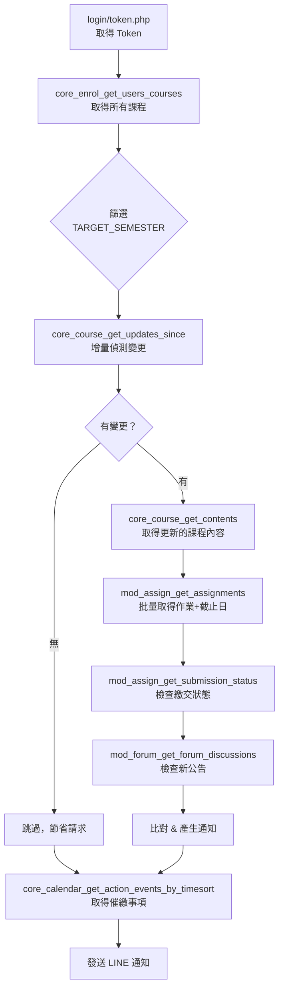

# NTNU Moodle Web Services API 完整參考

> 測試時間：2026-06-04 01:23  
> Moodle 版本：3.7+ (Build: 20190614)  
> 可用 API 總數：**349 個**，分屬 **52 個模組**  
> Token 取得方式：`login/token.php` + `service=moodle_mobile_app`

---

## 🎯 對通知器最有用的 API（核心）

這些 API 可以直接取代目前的 HTML 解析，大幅提升速度和穩定性。

### 📚 課程相關

| API | 用途 | 取代現有功能 |
|-----|------|-------------|
| `core_enrol_get_users_courses` | 取得使用者選修的所有課程列表（含 course ID、名稱） | ✅ 取代 `fetch_target_courses()` 的 HTML 解析 |
| `core_course_get_contents` | 取得單門課程的完整結構（區段、活動模組、檔案等） | ✅ 取代 `fetch_and_parse_course()` 的 HTML 解析 |
| `core_course_get_updates_since` | 取得課程自某時間戳以來的變更 | 🆕 **增量偵測**——只抓有變更的內容 |
| `core_course_check_updates` | 檢查課程特定模組是否有更新 | 🆕 可搭配上者使用 |
| `core_course_get_courses_by_field` | 依欄位（ID、shortname 等）查詢課程 | 可用於補充資訊 |

> [!TIP]
> `core_course_get_updates_since` 是**最重要的新發現**。目前的通知器需要完整抓取所有課程內容再比對 hash，而這個 API 可以直接問 Moodle「自從上次以來有什麼變了」，大幅減少請求量。

---

### 📝 作業相關

| API | 用途 | 取代現有功能 |
|-----|------|-------------|
| `mod_assign_get_assignments` | 批量取得多門課程的作業列表（含名稱、截止時間戳、說明） | ✅ 取代逐頁抓取作業頁面 |
| `mod_assign_get_submission_status` | 取得單一作業的繳交狀態（已交/未交/草稿） | ✅ 取代 HTML 解析「繳交狀態」 |
| `mod_assign_get_submissions` | 批量取得多項作業的所有繳交紀錄 | 可用於批次檢查繳交狀態 |
| `mod_assign_get_grades` | 取得作業成績 | 🆕 可新增「成績通知」功能 |

> [!IMPORTANT]
> **關鍵優勢**：`mod_assign_get_assignments` 回傳的 `duedate` 是 **Unix timestamp**（如 `1718236200`），不需要再用正則解析 `"2026 年 6 月 13 日(五) 00:00"` 這種中文日期字串，完全消除了 `parse_moodle_date()` 的語系相容性問題。

---

### 💬 討論區/公告

| API | 用途 | 取代現有功能 |
|-----|------|-------------|
| `mod_forum_get_forums_by_courses` | 取得課程中的所有討論區（含「公告」） | 🆕 目前未偵測公告 |
| `mod_forum_get_forum_discussions` | 取得討論區中的討論串列表 | 🆕 可偵測新公告/新帖 |
| `mod_forum_get_discussion_posts` | 取得單一討論串的所有回覆 | 🆕 可偵測公告內容變更 |

> [!NOTE]
> 很多教授會用 Moodle 的「公告」討論區發布重要通知（如調課、考試範圍），目前的通知器完全不會偵測到。搭配這些 API，可以新增公告追蹤功能。

---

### 📅 行事曆（超實用！）

| API | 用途 | 取代現有功能 |
|-----|------|-------------|
| `core_calendar_get_action_events_by_timesort` | 依時間排序取得待辦事項（作業、測驗等） | 🆕 **一個 API 抓到所有即將到期的事項** |
| `core_calendar_get_action_events_by_courses` | 依課程取得待辦事項 | 🆕 同上，按課程分組 |
| `core_calendar_get_calendar_events` | 取得行事曆事件 | 🆕 含自訂事件 |
| `core_calendar_get_calendar_upcoming_view` | 取得即將到來的事件視圖 | 🆕 最適合催繳通知 |

> [!TIP]
> `core_calendar_get_action_events_by_timesort` 可能是**效率最高的催繳偵測方式**。不需要逐門課程抓取作業再比對截止時間——直接向 Moodle 要「未來 7 天內到期的所有事項」即可。

---

### 📊 成績相關

| API | 用途 |
|-----|------|
| `gradereport_user_get_grade_items` | 取得使用者的成績項目 |
| `gradereport_user_get_grades_table` | 取得成績表（HTML 格式） |
| `gradereport_overview_get_course_grades` | 取得各課程總成績概覽 |

> 🆕 可新增「成績更新通知」——教授改完分數時推送通知。

---

### 🔔 Moodle 站內通知

| API | 用途 |
|-----|------|
| `message_popup_get_popup_notifications` | 取得彈出通知 |
| `message_popup_get_unread_popup_notification_count` | 取得未讀通知數量 |

> 🆕 Moodle 本身就有通知系統（作業截止、討論回覆等），可以直接讀取 Moodle 的通知再轉發到 LINE。

---

### 📁 檔案/資源

| API | 用途 | 取代現有功能 |
|-----|------|-------------|
| `mod_resource_get_resources_by_courses` | 取得課程中的所有檔案資源 | ✅ 更精確的檔案變更偵測 |
| `core_files_get_files` | 取得檔案資訊 | 可用於檢查檔案是否更新 |
| `mod_folder_get_folders_by_courses` | 取得資料夾模組 | 偵測資料夾內新增檔案 |

---

### 🧪 測驗 (Quiz)

| API | 用途 |
|-----|------|
| `mod_quiz_get_quizzes_by_courses` | 取得課程中的測驗列表 |
| `mod_quiz_get_user_attempts` | 取得使用者的測驗作答紀錄 |
| `mod_quiz_get_user_best_grade` | 取得最佳成績 |

> 🆕 可偵測新測驗公告、測驗成績更新。

---

## 🔧 系統/工具類 API

| 模組 | API 數量 | 說明 |
|------|---------|------|
| `core_webservice` | 1 | 站台資訊（`get_site_info`）—— 用於取得 user ID |
| `tool_mobile` | 6 | 行動裝置相關（autologin key、config 等） |
| `core_user` | 13 | 使用者管理（大多為管理員用途） |
| `core_message` | 47 | Moodle 站內訊息（非通知器需要） |
| `core_competency` | 9 | 學習歷程/能力指標（非通知器需要） |

---

## 📦 完整模組清單（52 個模組）

````carousel
### 核心模組 (core_*)

| 模組 | API 數 | 與通知器相關性 |
|------|--------|---------------|
| `core_calendar` | 14 | ⭐⭐⭐ 行事曆/催繳 |
| `core_course` | 16 | ⭐⭐⭐ 課程內容/變更偵測 |
| `core_enrol` | 3 | ⭐⭐⭐ 課程列表 |
| `core_completion` | 4 | ⭐⭐ 活動完成狀態 |
| `core_files` | 1 | ⭐⭐ 檔案資訊 |
| `core_webservice` | 1 | ⭐⭐ 站台資訊 |
| `core_message` | 47 | ⭐ 站內訊息 |
| `core_user` | 13 | ⭐ 使用者資訊 |
| `core_block` | 2 | — |
| `core_blog` | 2 | — |
| `core_badges` | 1 | — |
| `core_comment` | 1 | — |
| `core_competency` | 9 | — |
| `core_filters` | 1 | — |
| `core_get` | 1 | — |
| `core_group` | 3 | — |
| `core_notes` | 4 | — |
| `core_question` | 1 | — |
| `core_rating` | 2 | — |
| `core_tag` | 5 | — |
<!-- slide -->
### 活動模組 (mod_*)

| 模組 | API 數 | 與通知器相關性 |
|------|--------|---------------|
| `mod_assign` | 22 | ⭐⭐⭐ 作業/繳交偵測 |
| `mod_forum` | 15 | ⭐⭐⭐ 公告/討論區 |
| `mod_resource` | 2 | ⭐⭐ 檔案資源 |
| `mod_quiz` | 18 | ⭐⭐ 測驗 |
| `mod_folder` | 2 | ⭐⭐ 資料夾 |
| `mod_workshop` | 19 | ⭐ 工作坊 |
| `mod_lesson` | 17 | ⭐ 課程教案 |
| `mod_feedback` | 14 | ⭐ 問卷回饋 |
| `mod_data` | 11 | ⭐ 資料庫模組 |
| `mod_glossary` | 15 | — 詞彙表 |
| `mod_wiki` | 10 | — 維基 |
| `mod_scorm` | 9 | — SCORM 教材 |
| `mod_chat` | 8 | — 聊天室 |
| `mod_choice` | 6 | — 投票 |
| `mod_survey` | 4 | — 問卷調查 |
| `mod_lti` | 3 | — 外部工具 |
| `mod_book` | 2 | — 書籍 |
| `mod_page` | 2 | — 頁面 |
| `mod_url` | 2 | — 外部連結 |
| `mod_imscp` | 2 | — IMS 內容包 |
| `mod_label` | 1 | — 標籤 |
<!-- slide -->
### 其他模組

| 模組 | API 數 | 說明 |
|------|--------|------|
| `gradereport_user` | 3 | ⭐⭐ 成績報告 |
| `gradereport_overview` | 2 | ⭐⭐ 成績概覽 |
| `message_popup` | 2 | ⭐⭐ Moodle 彈出通知 |
| `tool_mobile` | 6 | 行動裝置工具 |
| `tool_lp` | 8 | 學習計畫 |
| `message_airnotifier` | 4 | 推播通知設定 |
| `report_insights` | 2 | 分析報告 |
| `block_recentlyaccesseditems` | 1 | 最近存取項目 |
| `block_starredcourses` | 1 | 收藏課程 |
| `enrol_guest` | 1 | 訪客選課 |
| `enrol_self` | 2 | 自助選課 |
````

---

## 🚀 用 API 改造通知器的建議架構

基於以上 API 分析，建議的資料流程：



### 預期效能改善

| 指標 | 目前 (HTML 解析) | 改用 API 後 |
|------|-----------------|------------|
| 請求數量 | ~50-100+ (每個活動一個) | ~5-10 (批量 API) |
| 回應大小 | 大 (完整 HTML 頁面) | 小 (精簡 JSON) |
| 解析方式 | BeautifulSoup HTML 解析 | 原生 JSON `dict` |
| 日期解析 | 正則匹配中文日期 | Unix timestamp |
| 執行時間 | ~1-2 分鐘 | 預估 **10-20 秒** |
| 穩定性 | 受 HTML 改版影響 | API 有版本保障 |

---

## ⚠️ 注意事項

1. **Token 有效期**：Moodle Mobile Token **不會過期**，除非使用者手動撤銷或管理員重設。可以安全地存在 GitHub Secrets 中重複使用，不需要每次執行都重新取得。

2. **速率限制**：Moodle 預設沒有 API 速率限制，但學校可能有自訂設定。建議保持合理間隔。

3. **Token 權限**：`moodle_mobile_app` 服務的 token 只有讀取權限（`mod_assign_save_submission` 等寫入 API 也在列表中，但學生角色通常無權使用危險操作）。

4. **向下相容**：NTNU 的 Moodle 版本是 3.7（2019），API 穩定但缺少 4.x 的新功能。
