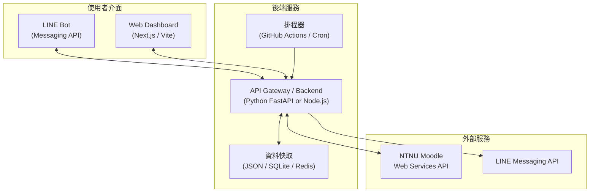

# 📋 Moodle 替代平台 — 需求規格文件

> **專案願景**：讓使用者完全不再需要開啟 Moodle 網頁，透過 LINE Bot + 自製 Web Dashboard 即可完成所有日常學習操作。

---

## 🔬 API 能力驗證結果

以下是針對每個關鍵功能的實測結果，確認 API 可行性：

| 功能 | API 可行性 | 實測結果 |
|------|-----------|---------|
| 課程列表 | ✅ 完全可用 | 取得 11 門 1142 課程，含 ID、名稱 |
| 課程內容瀏覽 | ✅ 完全可用 | 取得區段、活動模組、完整結構 |
| 檔案下載 | ✅ 完全可用 | Token 附加 URL 即可下載，HEAD 請求回傳 200 |
| 作業列表+截止日 | ✅ 完全可用 | Unix timestamp 格式，含 HTML 說明文字 |
| 繳交狀態 | ✅ 完全可用 | `submitted` / `new` 狀態，含繳交時間 |
| 成績查詢 | ✅ 完全可用 | 取得分數如 `100.00`，含成績項目名稱 |
| 討論區/公告 | ✅ 完全可用 | 取得公告內容（HTML 格式）、作者、時間 |
| 行事曆待辦 | ✅ 完全可用 | 取得即將到期事項，含課程名、URL |
| 私訊讀取 | ✅ 完全可用 | 取得對話列表、最新訊息、未讀數 |
| 私訊發送 | ✅ API 存在 | `send_instant_messages` 可用（未實測發送） |
| 站內通知 | ✅ 完全可用 | 取得通知列表、未讀數 |
| 增量更新偵測 | ✅ 完全可用 | `get_updates_since` 可偵測 24h 內變更 |
| 作業繳交 | ⚠️ API 存在但複雜 | `mod_assign_save_submission` 需上傳檔案流程 |
| 線上測驗 | ⚠️ API 存在但極複雜 | 需完整模擬答題流程，不建議在 v1 實作 |

---

## 🎯 目標使用者情境

```
身為一個 NTNU 學生，我希望：

早上起床 → 打開 LINE → 看到昨晚老師上傳的新講義通知
          → 直接在 LINE 中點擊下載講義 PDF
          
上課期間 → 收到 LINE 推播「計算物理 公告：明天期中考改至 B103」

下午回家 → 打開自製 Web Dashboard
          → 一眼看到所有課程的作業狀態、成績、待辦
          → 下載上課檔案
          → 查看各科成績

晚上睡前 → 收到 LINE 日報：今日 2 門課有更新，1 個作業 3 天後截止
          → 收到 LINE 轉發的 Moodle 私訊通知
```

---

## 📦 功能模組

### 模組 1：課程總覽 (Course Overview)

**目的**：取代 Moodle 首頁的課程列表

| 需求 | LINE Bot | Web Dashboard | 所需 API |
|------|---------|---------------|----------|
| 查看本學期所有課程 | `/courses` 指令 | 首頁課程卡片 | `core_enrol_get_users_courses` |
| 課程基本資訊（名稱、教師） | 文字列表 | 卡片展示 | 同上 |
| 自動篩選當前學期 | ✅ | ✅ | 依 `fullname` 篩選 |

---

### 模組 2：課程內容瀏覽 (Course Content)

**目的**：取代 Moodle 課程頁面，瀏覽每門課的區段、活動、資源

| 需求 | LINE Bot | Web Dashboard | 所需 API |
|------|---------|---------------|----------|
| 瀏覽課程內容結構 | `/course [課名]` 指令 | 展開式區段列表 | `core_course_get_contents` |
| 檢視活動模組（作業、檔案、討論區…） | 文字清單 | 圖示分類列表 | 同上 |
| 偵測課程內容變更 | 🔔 自動推播 | 🔴 紅點標示 | `core_course_get_updates_since` |

---

### 模組 3：作業追蹤 (Assignment Tracker)

**目的**：取代 Moodle 作業頁面，集中管理所有作業

| 需求 | LINE Bot | Web Dashboard | 所需 API |
|------|---------|---------------|----------|
| 列出所有作業 + 截止時間 | `/assignments` 指令 | 作業列表頁 | `mod_assign_get_assignments` |
| 查看繳交狀態 | 顯示 ✅/❌ | 狀態標籤 | `mod_assign_get_submission_status` |
| 查看作業說明 | 回傳說明文字 | 展開詳情 | `assignments[].intro` |
| 死線分級提醒 | 🔔 自動推播 | 顏色標示 | `assignments[].duedate` |
| 已逾期未繳偵測 | 🔔 自動推播 | ⚠️ 警告標示 | 比對 duedate + status |
| 作業附件下載 | 檔案連結 | 下載按鈕 | `introattachments[]` |
| 新作業通知 | 🔔 自動推播 | 🔴 紅點 | 與歷史資料比對 |
| 作業說明修改通知 | 🔔 自動推播 | 變更標記 | 比對 `intro` hash |

---

### 模組 4：檔案中心 (File Hub)

**目的**：集中管理所有課程的檔案資源，取代在各課程頁面翻找

| 需求 | LINE Bot | Web Dashboard | 所需 API |
|------|---------|---------------|----------|
| 列出所有檔案資源 | `/files [課名]` 指令 | 檔案管理頁 | `mod_resource_get_resources_by_courses` |
| 檔案下載 | 附帶 token 的 URL | 下載按鈕 | `fileurl + token` |
| 新檔案上傳通知 | 🔔 自動推播 | 🔴 紅點 | 與歷史比對 |
| 檔案更新通知 | 🔔 自動推播 | 更新標記 | `timemodified` 比對 |
| 資料夾模組 | 展開列表 | 樹狀結構 | `mod_folder_get_folders_by_courses` |
| 檔案搜尋 | — | 🔍 搜尋欄 | 前端篩選 |

---

### 模組 5：公告與討論 (Announcements & Forums)

**目的**：取代 Moodle 討論區，特別是「公告」型論壇

| 需求 | LINE Bot | Web Dashboard | 所需 API |
|------|---------|---------------|----------|
| 各課程公告列表 | `/announcements` 指令 | 公告頁（按課程分組） | `mod_forum_get_forums_by_courses` |
| 公告內容閱讀 | 回傳完整內容 | 展開閱讀 | `mod_forum_get_forum_discussions` |
| 新公告推播 | 🔔 自動推播（最高優先） | 🔴 紅點 + 置頂 | 與歷史比對 |
| 討論串回覆閱讀 | — | 留言列表 | `mod_forum_get_discussion_posts` |

> [!IMPORTANT]
> 公告通知應視為**最高優先級**的推播——教授經常透過公告發布考試範圍修改、調課、教室變更等重要資訊。

---

### 模組 6：成績中心 (Grade Center)

**目的**：取代 Moodle 成績頁面，集中查看所有課程成績

| 需求 | LINE Bot | Web Dashboard | 所需 API |
|------|---------|---------------|----------|
| 各課程成績概覽 | `/grades` 指令 | 成績儀表板 | `gradereport_overview_get_course_grades` |
| 單科成績明細 | `/grade [課名]` 指令 | 展開成績表 | `gradereport_user_get_grade_items` |
| 成績更新通知 | 🔔 自動推播 | 🆕 標記 | `core_course_get_updates_since` |

---

### 模組 7：私訊轉發 (Messaging Bridge)

**目的**：將 Moodle 私訊橋接到 LINE

| 需求 | LINE Bot | Web Dashboard | 所需 API |
|------|---------|---------------|----------|
| 未讀私訊通知 | 🔔 自動推播 | 🔴 紅點 | `core_message_get_unread_conversation_counts` |
| 閱讀私訊 | 回傳最新訊息 | 對話介面 | `core_message_get_conversations` |
| 回覆私訊 | — (v2 考慮) | 回覆框 (v2) | `core_message_send_instant_messages` |

> [!NOTE]
> v1 先做「通知+閱讀」，「回覆」功能等 v2 再實作（需考慮安全性）。

---

### 模組 8：行事曆與待辦 (Calendar & Todo)

**目的**：整合所有時間相關事件，取代 Moodle 行事曆

| 需求 | LINE Bot | Web Dashboard | 所需 API |
|------|---------|---------------|----------|
| 即將到期事項 | `/upcoming` 指令 | 行事曆視圖 | `core_calendar_get_action_events_by_timesort` |
| 每日待辦摘要 | 🔔 每日日報 | 待辦清單 | 同上 |
| 依課程篩選事件 | — | 課程篩選器 | `core_calendar_get_action_events_by_courses` |

---

## 🤖 LINE Bot 互動設計

### 指令系統

```
📚 課程相關
  /courses              — 查看本學期所有課程
  /course [課名關鍵字]    — 查看特定課程內容

📝 作業相關
  /assignments          — 列出所有待辦作業
  /assignment [課名]     — 查看特定課程的作業詳情

📁 檔案相關
  /files [課名]          — 列出課程檔案

📢 公告相關
  /announcements        — 查看最新公告
  /announcement [課名]   — 查看特定課程公告

📊 成績相關
  /grades               — 成績概覽
  /grade [課名]          — 特定課程成績

💬 私訊相關
  /messages             — 查看最新私訊

📅 行事曆
  /upcoming             — 即將到期的事項
  /today                — 今日事項

⚙️ 設定
  /help                 — 使用說明
  /status               — 系統狀態
```

### 自動推播時機

| 事件 | 推播時機 | 優先級 |
|------|---------|-------|
| 新公告 | 偵測到即推 | 🔴 最高 |
| 新作業 | 偵測到即推 | 🔴 最高 |
| 作業說明修改 | 偵測到即推 | 🟡 高 |
| 新檔案/檔案更新 | 偵測到即推 | 🟡 高 |
| 成績更新 | 偵測到即推 | 🟡 高 |
| Moodle 私訊 | 偵測到即推 | 🟡 高 |
| 作業 24h 內到期 | 催繳（去重） | 🟠 中 |
| 作業 3 天內到期 | 提醒（每日一次） | 🔵 低 |
| 每日日報 | 每天 18:00 | 📊 定時 |
| 系統異常 | 立即通知 | 🚨 緊急 |

---

## 🌐 Web Dashboard 頁面規劃

```
/                     — 首頁儀表板（待辦、最新通知、課程總覽）
/courses              — 課程列表
/courses/:id          — 單一課程詳情（內容、檔案、作業、公告）
/assignments          — 作業追蹤器（跨課程彙整）
/files                — 檔案中心
/grades               — 成績中心
/announcements        — 公告中心
/calendar             — 行事曆視圖
/messages             — 私訊 (v2)
/settings             — 個人設定
```

---

## 🏗 技術架構



---

## ⚙️ 已決定的架構與設計決策

以下為與使用者討論後確定的核心決策，將作為後續開發（Phase 1-3）的基準：

### Q1：部署環境
* **決策**：**混合模式（GitHub Actions + 免費雲端）**
* **實作細節**：
  * **初期**：使用免費的 **GitHub Actions** 執行定時排程推播，並將 **FastAPI 後端** 部署於免費雲端平台（如 **Render**）以處理 LINE Webhook 互動指令。
  * **後期**：當免費額度不足或有自有伺服器時，可無縫遷移至自有伺服器（Self-hosted VPS / Docker）。

### Q2：LINE Bot 互動模式
* **決策**：**選項 B（推播 + 互動指令）**
* **實作細節**：使用者不僅能接收主動推播（Push API），還能在 LINE 中發送指令（如 `/assignments`, `/grades`）查詢即時資訊。指令回覆使用 **Reply API**（完全免費，不計入 LINE 訊息額度），Webhook 由 Render 上的 FastAPI 後端處理。

### Q3：Web Dashboard 技術棧
* **決策**：**前後端分離（Vite SPA + FastAPI 後端）**
* **實作細節**：前端使用 **Vite + Vanilla JS/CSS** 構建輕量且極致流暢的單頁面應用（SPA），部署於免費的 **GitHub Pages**。後端使用 **FastAPI** 作為 API Gateway 代理與 Moodle 的連線，確保安全與認證。

### Q4：開發與範圍優先級
* **決策**：**同意分階段開發計畫**
  * **Phase 1**：核心重構（API 驅動、模組化、抽象通知介面，新增公告/成績/私訊通知，繼續跑在 GitHub Actions）。
  * **Phase 2**：LINE Bot 互動（FastAPI 後端 + LINE Webhook 部署至 Render）。
  * **Phase 3**：Web Dashboard 實作與 GitHub Pages 部署。

### Q5：是否仍作為開源模板？
* **決策**：**是，依然作為開源模板**
* **設計考量**：架構設計需保持高度的可配置性與模組化，讓其他 fork 此模板的使用者能以最簡單的步驟（例如設定 GitHub Secrets 與 Render 一鍵部署）完成屬於自己的 Moodle 替代平台。

### Q6：多通訊軟體支援？
* **決策**：**是，考慮到後續會支援 Discord**
* **設計考量**：在 Phase 1 的核心重構中，必須嚴格遵循 **依賴倒置原則（DIP）**，設計一個抽象的通知基類 `NotifierBase`。LINE、Discord 或未來的 Telegram 僅作為其實作類別，主入口 `main.py` 與監控器（Monitors）只依賴於抽象介面，以便未來輕鬆擴充其他通訊軟體。

